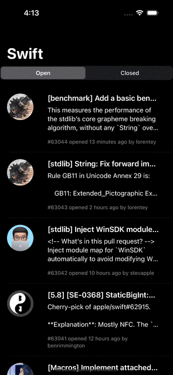
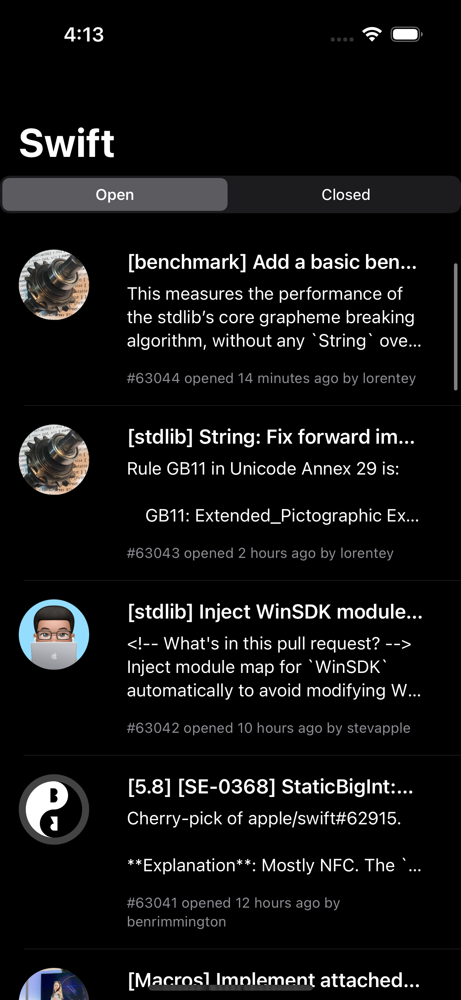
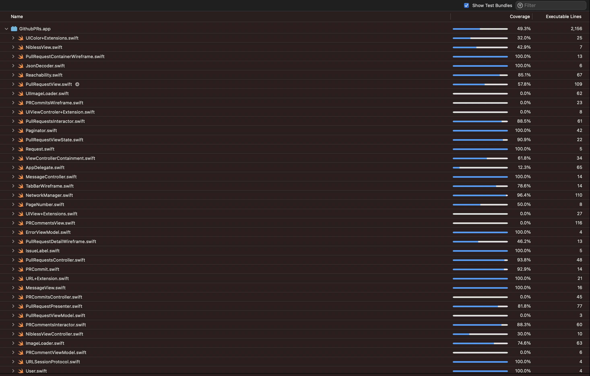
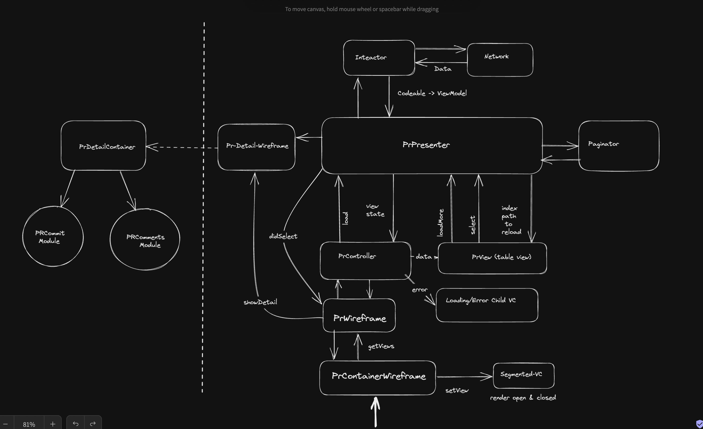

## 1. Assignment

by [Amandeep](mailto:amandeep.saluja21@gmail.com).

## 2. Requirements
- iOS 13.0+
- Tested on iOS 16 Simulator
- [Xcode 14.0.1+]

## 3. Getting Started
- Open `GithubPRs.xccodeproj` in Xcode

## 4. API
[API](https://api.github.com/repos/apple/swift/pulls?page=1&per_page=10)

## 5. Swift
This project is build using Swift 5.

## 6. 3rd Party
- None

## 7. Unit/UI Test case
 - Test coverage is 49%
 - There are tests for presenters.
 - There are tests for interactors.
 - There are tests for wireframes.
 - There are tests to test the pagination logic.
 

## 8. Architecture 
- In this project, I'm using **VIPER** architecture.
I have slightly modified VIPER to use completion handler for InteractorToView communication
and use a closure wrapper(Observable) for PresenterToView communication. This helped me trim down
boilerplate code for testing.
- Note: I am referring to the domain representation of APIResponse/Codeable as ViewModel.
- Heavily using Container ViewController to prevent massive view controllers.
- Container ViewControllers are used to render messages as well as the UISegmentedControl.
- Navigation is scalable for multiple tabs and authenticaiton flow.
- Using URLSession cache for caching due to time constraints. However if I had a choice I would go for core data due to structured data and relationship b/w repo/branch/PRs/commits/files etc
- You might see certain code duplication across commits/comments/PR module. This is intentional.
   We don't want to prematurely optimize. For e.g in the future comments feature can be extended to support replying to comments (chat)

## 9. Features 
 - Two main screens: PullRequestList and PullRequestDetail.
 - PullRequestList: I have provided 'open' and 'closed' filters
 - PullRequestDetail: Comments list and Commits list.
 - Clicking on PullRequestDetail opens Safari.
 - Image caching.
 - All screens are pagianted.
 - Extensible for API response caching since Interactor only exposes domain model and not codable.
 - Both API requests and image requests are cancellable.
 - Dark mode is supported.
 - Dynamic cell height.
